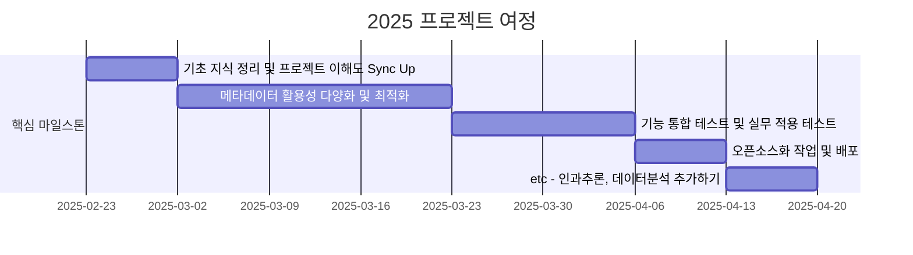

<h1 align="center"> Lang2SQL </h1>

<div align="center">
<a href="https://pseudo-lab.com"></a>
<a href="https://discord.gg/EPurkHVtp2"></a>
<a href="https://github.com/Pseudo-Lab/lang2sql/stargazers"></a>
<a href="https://github.com/Pseudo-Lab/lang2sql/network/members"></a>
<a href="https://github.com/Pseudo-Lab/lang2sql/pulls"></a>
<a href="https://github.com/Pseudo-Lab/lang2sql/issues"></a>
<a href="https://github.com/Pseudo-Lab/lang2sql/graphs/contributors"></a>
<a href="https://hits.seeyoufarm.com"></a>
</div>
<br>

<!-- sheilds: https://shields.io/ -->
<!-- hits badge: https://hits.seeyoufarm.com/ -->

> We aim to automate SQL generation from natural language, offering tools and frameworks for query generation, schema exploration, and query optimization. Join us in advancing the field of AI-driven data analysis through open collaboration and innovation!

## 🌟 프로젝트 목표 (Project Vision)
_"박치기공룡들의 배포부터 시작하는 프로젝트"_  
- [lang2sql](https://pypi.org/project/lang2sql/) 오픈소스 패키지 1.0.0 달성하기
- 오픈소스 협업: 더 많은 사람들이 참여할 수 있도록, 코드와 아이디어를 GitHub으로 공유합니다.
- LangGraph 기반 쿼리 생성: 단순한 SQL 생성이 아닌, 최적화된 SQL 제공을 목표로 합니다.


## 🧑 역동적인 팀 소개 (Dynamic Team)

| 역할          | 이름 |  기술 스택 배지                                                                 | 주요 관심 분야                          |
|---------------|------|-----------------------------------------------------------------------|----------------------------------------|
| **Project Manager** | 이동욱 |   | LLM 오픈소스 인과추론             |


## 🚀 프로젝트 로드맵 (Project Roadmap)



## 🛠️ 우리의 개발 문화 (Our Development Culture)
**우리의 개발 문화**  
```python
class CollaborationFramework:
    def __init__(self):
        self.tools = {
            'communication': 'Discord',
            'version_control': 'GitHub Projects',
            'ci/cd': 'GitHub Actions',
            'docs': 'Github Wiki'
        }
    
    def workflow(self):
        return """주간 사이클:
        1️⃣ 월요일: 코드 리뷰 세션 & 주간목표 설정 (Live Share)
        3️⃣ 금요일: 진행상황 체크 (logging)
```


## 📈 성과 지표 (Achievement Metrics)
**2025 주요 KPI**  
| 지표                     | 목표치 | 현재 달성률 |
|--------------------------|--------|-------------|
| 커밋 수                  | 100  | 0%         |
| 배포 버전 1.0.0 달성              | 1.0.0    | 16%         | 


## 💻 주차별 활동 (Activity History)

| 날짜 | 내용 | 발표자 | 
| -------- | -------- | ---- |
| 2025/02/ | OT       |      |
| 2025/02/ |  Part 1. | 미정 | 
| 2025/02/ |  Part 2. | 미정 | 
| 2025/02/ |  Part 3. | 미정 | 
| 2025/03/ |  Part 4. | 미정 | 
| 2025/03/ |  Part 5. | 미정 | 


## 💡 학습 자원 (Learning Resources)

- [테디노트 LangGraph](https://wikidocs.net/233785)
- [DataHub 설명](https://hyojupark.github.io/data/introducing-datahub/)

## 🌱 참여 안내 (How to Engage)
**팀원으로 참여하시려면 러너 모집 기간에 신청해주세요.**  
- 링크 (준비중)

**누구나 청강을 통해 모임을 참여하실 수 있습니다.**  
1. 특별한 신청 없이 정기 모임 시간에 맞추어 디스코드 #Room-GH 채널로 입장
2. Magical Week 중 행사에 참가
3. Pseudo Lab 행사에서 만나기

## Acknowledgement 🙏

Lang2SQL is developed as part of Pseudo-Lab's Open Research Initiative. Special thanks to our contributors and the open source community for their valuable insights and contributions.

## About Pseudo Lab 👋🏼</h2>

[Pseudo-Lab](https://pseudo-lab.com/) is a non-profit organization focused on advancing machine learning and AI technologies. Our core values of Sharing, Motivation, and Collaborative Joy drive us to create impactful open-source projects. With over 5k+ researchers, we are committed to advancing machine learning and AI technologies.

<h2>Contributors 😃</h2>
<a href="https://github.com/Pseudo-Lab/lang2sql/graphs/contributors">
  
</a>
<br><br>

<h2>License 🗞</h2>

This project is licensed under the [MIT License](https://opensource.org/licenses/MIT).
