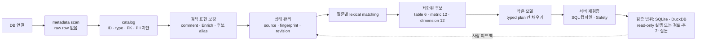

# Lang2SQL

<div align="center">
<a href="https://pseudo-lab.com"></a>
<a href="https://discord.gg/EPurkHVtp2"></a>
<a href="https://github.com/CausalInferenceLab/lang2sql/stargazers"></a>
<a href="https://github.com/CausalInferenceLab/lang2sql/network/members"></a>
<a href="https://github.com/CausalInferenceLab/lang2sql/pulls"></a>
<a href="https://github.com/CausalInferenceLab/lang2sql/issues"></a>
<a href="https://github.com/CausalInferenceLab/lang2sql/graphs/contributors"></a>
</div>

<p align="center">
  <strong>우리는 함께 코드와 아이디어를 나누며 더 나은 데이터 환경을 만들기 위한 오픈소스 여정을 떠납니다. 🌍💡</strong>
</p>

---

> **A document-learning, read-only SQL analytics agent.**
> Feed it your company's docs → it learns your business context → it keeps a
> *separate* set of definitions per team → it answers questions over an
> incomplete database → it remembers every definition and conversation.

> **이번 변경의 위치:** 기존 ContextFlow를 대체하지 않는다. Enrich, Semantic
> federation, Memory, Discord 흐름은 유지하고, catalog가 활성화된 연결의 **DB 질의
> 실행 경계**만 검토형 typed plan으로 강화한다.

👉 **프로젝트 전체 그림(단일 SSOT)**: [`docs/PROJECT.md`](docs/PROJECT.md) · **컨트리뷰터 한눈 가이드**: [`docs/ARCHITECTURE.md`](docs/ARCHITECTURE.md)

This is the **v4.1 rebuild** (배경/설계 의도: [`docs/discord_first_redesign_v4_1.md`](docs/discord_first_redesign_v4_1.md)).
Where most text-to-SQL projects compete on *"generate better SQL,"* Lang2SQL
competes on everything *around* the query: business-context learning, per-team
semantics, robustness to messy databases, and memory. **Discord is the Phase 1
interface, not the identity** — Slack/Web are adapters on the same core.

---

## The four pillars

| Pillar | What it is |
|---|---|
| **① Business-context learning** | Documents are the source of truth. Drop in a doc → the agent extracts metric/dimension/rule candidates → you confirm → they land in the semantic layer. |
| **② Two-axis robustness** | **(2a) DB robustness** — starts from physical metadata and candidate-only enrichment even when descriptions are incomplete. **(2b) Semantic robustness** — teams hold *different* definitions of the same term without conflict. This axis is the product/research identity. |
| **③ Hermes memory** | Conversations, facts, and preferences persist instead of resetting each session. |
| **④ Multi-interface** | Phase 1 Discord today; Slack/Web are future adapters. No platform lock-in. |

### 이번 PR: 연결 즉시 의미 준비형 질의

핵심은 도메인별 `if` 문이나 SQL template을 늘리는 것이 아니다.

- **연결별 사실:** DB metadata 기반 catalog를 만들고 버전 관리한다.
- **공통 실행 규칙:** catalog의 허용 ID만 typed plan과 SQL로 컴파일한다.
- **모델의 역할:** 전체 schema 검색이나 SQL 작성이 아니라, 상한으로 제한된
  후보의 ID와 정해진 입력 칸만 고른다.

#### 데이터 연결부터 질문 처리까지

1. **연결 확인**
   - Discord `/setup` 또는 공개 API `connect`가 연결을 시험한다.
   - 인증 정보와 DB 연결은 서버 안에만 두며 모델에 전달하지 않는다.
   - 기존 ContextFlow의 tenancy·Memory·Federation은 유지한다. catalog가 없는
     기존 경로에는 Explore/Enrich도 그대로 남는다.

2. **물리 metadata를 catalog로 변환**
   - table·column·type·nullable·PK/FK·DB comment만 읽는다.
   - 연결 시 raw row나 값 목록을 표본 추출하지 않는다.
   - PII형·자유서술형·key column은 차단하고, 수치·시간·분류 column은
     metric/dimension **후보**로 분류한다.
   - `metric:orders.amount`처럼 안정적인 ID, 허용 집계, 선언된 join을 기록한다.
   - 자동 발견한 수치 column은 업무 지표로 확정하지 않고 검토 대기 상태로 둔다.

   → 작은 모델은 잡음과 민감정보가 제거된 구조만 보며, table·column·join을
   처음부터 추론하지 않는다.

3. **검색용 표현을 자동 보강**
   - DB comment를 후보 alias로 반영한다.
   - 같은 source와 같은 물리 fingerprint일 때만 기존 Enrich 설명을 재사용한다.
   - `LANG2SQL_AUTO_METADATA_ENRICH=auto`와 실제 provider가 설정되었거나
     `llm` 모드를 명시한 경우 metadata-only LLM 보강을 한 번 수행한다.
   - 충돌하거나 값 목록처럼 보이는 표현은 버리고, 보강 결과는 승인된 업무
     의미·공개 권한·join으로 승격하지 않는다.

   → 작은 모델은 물리명뿐 아니라 사람이 쓰는 표현으로도 후보를 찾을 수 있지만,
   자동 보강이 실행 권한을 넓히지는 못한다.

4. **연결별 상태를 저장하고 변경을 추적**
   - 암호화한 연결 정보와 catalog를 한 번에 활성화한다.
   - `source_id`·연결 세대(재연결마다 바뀌는 버전)·물리 fingerprint·검토
     revision을 함께 관리한다.
   - 재연결 scan에서 schema 변경이 감지되면 이전 질문 후보와 검토 상태를
     그대로 믿지 않고 무효화한다.
   - 사람이 승인·거절한 의미는 동일한 source/fingerprint에서만 이어받는다.
   - catalog와 검토 결정은 연결별로 저장한다. 검토 대기 중인 exact draft는
     같은 서버 process에서 최대 15분만 보관한다.
   - Discord `/semantic_status`에서 현재 후보·검토·보강 상태를 확인한다.

   → 매 질문마다 모델이 DB의 의미를 다시 복원하지 않고, 검증된 현재 상태를
   재사용한다.

5. **서버가 질문마다 후보 범위를 제한**
   - 서버는 VDB/embedding 대신 catalog의 물리명·승인 alias·후보 alias를
     **결정론적 lexical matching**으로 검색한다.
   - 최대 table 6개, metric 12개, dimension 12개로 attention envelope를 제한한다.
   - 작은 catalog는 상한 안의 후보 전체를 줄 수 있다. 넓은 catalog는 질문에
     정확히 나타난 metadata 표현으로 좁히며, 근거가 없거나 후보가 겹치면
     임의 선택 대신 추가 질문을 반환한다.
   - candidate token은 질문·사용자·대화·source·연결 세대에 묶는다.
   - plan 단계에서는 현재 catalog/revision 기준으로 shortlist를 다시 만들고,
     선택한 ID와 정책을 재검증한다.

   → 작은 모델에는 전체 schema가 아니라 상한으로 제한되고 현재 연결 상태에
   묶인 enum형 도구 schema만 전달된다.

6. **모델은 typed plan의 칸만 채움**
   - 입력: 후보 ID, 허용 집계, 공개 가능한 filter/time 선택지.
   - 출력: 허용된 metric/dimension ID와 집계, 질문에 명시된 허용 filter
     값·기간, 지원하지 못한 요구사항.
   - SQL 문자열·table·join·dialect는 모델 출력에 없다.

7. **서버가 재검증·컴파일하고, 필요한 의미만 사람이 검토**
   - 후보가 아직 현재 연결과 질문에 유효한지 다시 확인한다.
   - 유일하게 안전한 FK 경로, 타입, bound parameter, 공개 정책으로 SQL을 만든다.
   - 의미나 공개 범위가 미확정이면 사람 검토·추가 질문·명시적 차단으로 끝낸다.
   - 같은 요청자가 15분 안에 승인하면 검토에 묶인 exact draft를 재검증해
     이어갈 수 있다.
   - 다른 관리자 승인, 만료 또는 서버 재시작 뒤에는 이전 질문을 자동 실행하지
     않고 다시 제출받는다.
   - 현재 검토형 실행 근거는 read-only SQLite와 DuckDB에 한정한다.



예를 들어 필요한 의미·공개 범위·표현 검토가 끝난 연결에서 질문이
“status가 paid인 주문의 amount 합계”라면 모델은 전체 DB 대신
`metric:orders.amount`, `dimension:orders.status`, `SUM`, `EQ`만 받고
`metric_id=metric:orders.amount`, `aggregate=SUM`,
`filter.dimension_id=dimension:orders.status`, `operator=EQ`, `value="paid"`처럼
조립한다.
catalog가 활성화된 연결에서는 이 `semantic_query`가 모델의 `run_sql`을
대체한다. 즉 작은 모델이 잘할 수 있는 이유는 더 많이 추론해서가 아니라,
**서버가 연결 시 의미 후보를 준비·버전 관리하고 질문 시 선택지를 먼저 줄이기
때문**이다.

자세한 흐름과 제한은 [`연결 즉시 의미 준비형 질의`](docs/REVIEWED_SEMANTIC_QUERY.md)를
참고한다.

## Extensibility — outlets and appliances (콘센트/가전)

V1 ships the **simplest single implementation** of each extension point, but the
**abstraction (port) is already in place**, so v1.5/v2 add a new implementation
*without touching existing code*. Like a wall outlet: the V1 socket has one LED
bulb plugged in, but because the socket is standard, you later plug in a fan or a
smart light without rewiring the wall.

Four ★ extension patterns sit behind `core/ports/`:

| ★ | Pattern | Port | Grows by |
|---|---|---|---|
| ① | **Safety pipeline** | `ports/safety.py` | adding one layer class to the line (zero `run_sql` changes) |
| ② | **Memory service** | `ports/memory.py` | swapping any of 3 axes — Store / Recall / Extractor — independently |
| ③ | **Ingestion pipeline** | `ports/ingestion.py` | a Source × Extractor matrix |
| ④ | **Semantic federation** | `ports/semantic_scope.py` | git-like per-team scope branches |

Everything outside `tenancy/concierge.py` depends only on these Protocols, so the
concrete classes (OpenAI, Postgres, SQLite) are swappable at the seams.

---

## Quickstart

Requires Python ≥ 3.10 and [uv](https://docs.astral.sh/uv/).

```bash
uv sync                       # create .venv and install deps
# DuckDB 파일도 연결할 때만 선택 dependency를 함께 설치
uv sync --extra duckdb
```

### 1. Run the offline demo (no token, no database)

```bash
.venv/bin/python bench/ecommerce_demo.py
```

Shows the federation money-shot (one term, two team definitions, no conflict) and
the safety gate (DROP/INSERT blocked, SELECT passes). See [`bench/README.md`](bench/README.md).

### 2. Run the CLI (developer driver)

```bash
.venv/bin/lang2sql "list the tables"
```

The CLI assembles a real `HarnessContext` and runs one turn through the agent
loop. With `OPENAI_API_KEY` set it calls `gpt-4.1-mini`; otherwise it uses the
offline `FakeLLM`.

### 3. Run the Discord bot

```bash
export DISCORD_BOT_TOKEN=...        # required
export OPENAI_API_KEY=...           # required for real answers, unless using local model below
export LANG2SQL_SECRET_KEY=...      # optional; Fernet key for secret encryption
# optional: parent channel IDs where non-admin members may query
export LANG2SQL_DISCORD_QUERY_CHANNEL_IDS=123456789012345678
.venv/bin/lang2sql-bot
```

Local OpenAI-compatible alternative:

```bash
export LANG2SQL_LLM_BASE_URL=http://127.0.0.1:11434
export LANG2SQL_LLM_MODEL=gemma4:26b
```

With neither provider configured, `FakeLLM` is only an installation smoke and
does not provide a meaningful semantic-query experience.

The bot exits loudly if `DISCORD_BOT_TOKEN` is unset. Full setup and hosting:
[`docs/DEPLOY.md`](docs/DEPLOY.md). Copy [`.env.example`](.env.example) to start.

### 앱에 내장하기: 모델이 SQL을 작성하지 않는 공개 API

Discord 외의 앱은 `Lang2SQLRuntime`의
`connect → candidates → feedback → plan → execute` 흐름을 사용할 수 있다.
호스트와 모델은 SQL 문자열을 만들거나 받지 않는다. DTO와 검토 루프는
[`docs/LIBRARY_API.md`](docs/LIBRARY_API.md)에 있다.

```bash
uv run python examples/semantic_runtime_quickstart.py
```

---

## What V1 does / does NOT do yet (honesty section)

**Does:**
- 3-scope semantic federation (guild / channel / member) with most-specific-wins
  resolution; `term_custom` registers definitions per scope (KV-backed).
- Safety pipeline with the V1 layers (whitelist + timeout), gating every query.
- Legacy raw mode includes `run_sql`, schema exploration/enrichment, semantic
  term, ingestion, memory, and clarification tools.
- 연결 즉시 의미 준비형 질의 모드는 catalog가 활성화된 연결에서 `run_sql`과
  sample-based schema exploration을 `semantic_query`로 교체한다.
- Memory service (in-memory store + inject-all recall + manual `/remember`).
- Discord frontend (bot, commands, session router, render).
- Encrypted-at-rest secrets (Fernet) and SQLite-backed persistence.
- Connect-time candidate enrichment from DB comments, the existing Enrich
  cache, and an optional metadata-only LLM pass; lazy business-meaning review;
  and a typed aggregate/group-by path over declared many-to-one FK paths.
- Private-by-default aggregate disclosure: fewer than five contributing rows
  blocks `SUM`/`AVG`/source-record `COUNT`, while `MIN`/`MAX` require an explicit
  public-data scope with no controlled dimension.

**Does NOT yet:**
- **Replace the no-DB default fixture.** If neither `LANG2SQL_DB_URL` nor
  Discord `/setup` supplies a connection, the canned `PostgresExplorer` remains
  the offline demo. Setup connections themselves execute through SQLAlchemy or
  D1 when their drivers and network are available.
- **Reason without a configured model.** Without `OPENAI_API_KEY` or the local
  model variables, `FakeLLM` returns deterministic canned tool cycles — useful
  for wiring tests, not for answers.
- Turn candidate enrichment into approved descriptions, business formulas, or
  inferred joins automatically. Richer semantic cards and feedback-driven
  enrichment, AST-precise SQL validation, function blocklists, cost gating,
  `/semantic diff` / `/semantic promote`, keyword/vector recall, automatic fact
  extraction, and URL/Notion ingestion remain v1.5+.
- Persist across restarts by default: the V1 `SqliteStore` defaults to in-memory;
  point it at a file for durability.
- Silently widen the typed-query boundary: advanced filters (OR/NOT, partial
  match, free search), timestamp/relative/fiscal/cohort time, unit conversion,
  derived formulas, composite joins, and fan-out joins fail closed rather than
  being guessed or dropped.
- Claim universal dialect parity: current public reviewed-execution evidence
  covers existing file-backed SQLite and DuckDB only. Connector availability and
  verified reviewed execution are reported separately; unverified remote
  dialects fail closed.

---

## Roadmap at a glance

| Area | V1 | V1.5 | V2 | V2.5 |
|---|---|---|---|---|
| **Safety** | whitelist + timeout | + AST validation, function blocklist, auto LIMIT, **richer semantic cards**, rate limit | + cost gate (EXPLAIN), per-engine pipelines | — |
| **Memory** | in-memory + inject-all + manual | SQLite store + keyword recall + auto-extract | + vector recall + conflict resolution | PostgreSQL + hybrid recall + confidence |
| **Ingestion** | file upload + LLM extract | + URL fetch + DDL parsing | + Notion/Confluence + hybrid | + GitHub/Drive + chunked RAG |
| **Federation** | 3-scope resolution, `/semantic show` | `/semantic diff`, `/semantic promote`, conflict alerts | git sync (semantic-as-code) | branch fork/merge UI, per-scope audit |
| **Interface** | Discord | (Anthropic/NIM eval) | Slack | Web |

See [`docs/discord_first_redesign_v4_1.md`](docs/discord_first_redesign_v4_1.md)
for the full architecture write-up.

---

## 🤝 기여하기

**처음 보시는 분은 [`docs/ARCHITECTURE.md`](docs/ARCHITECTURE.md)** — 디렉토리·레이어 책임, 한 메시지의 lifecycle, *어디를 수정하면 좋을지* 가 한곳에 정리돼 있습니다.

```bash
git clone https://github.com/CausalInferenceLab/lang2sql.git
cd lang2sql
uv sync --extra duckdb
uvx ruff check src/lang2sql tests bench/local_model_semantic_eval.py examples/semantic_runtime_quickstart.py
uv run mypy src/lang2sql examples/semantic_runtime_quickstart.py
uv run pytest -q
```

CI는 Python 3.10과 3.12에서 같은 검사를 실행하며 DuckDB 실행 경로를 필수로 확인한다.

- 새 기능에는 테스트 작성 (`tests/test_<layer>.py`)
- PR은 `master` 브랜치 대상, 커밋 메시지에 `feat:` / `fix:` / `docs:` prefix 사용
- 버그/기능 요청은 [이슈](https://github.com/CausalInferenceLab/lang2sql/issues)로

---

## 🙏 감사의 말 / License

Lang2SQL은 **가짜연구소의 인과추론팀**에서 개발 중인 프로젝트입니다. Licensed under
the [MIT License](https://opensource.org/licenses/MIT). 커뮤니티: [Discord](https://discord.gg/EPurkHVtp2).

---

## 🏆 Our Team

| Role | Name | Skills | Interests |
|------|------|--------|-----------|
| **Project Manager** | 이동욱 |  | LLM, Open Source, Causal Inference |
| **AI Engineer** | 문찬국 |  | LLM, Agentic RAG, Open Source |
| **Data Engineer** | 박경태 |  | LLM-driven Data Engineering |
| **AI Engineer** | 손봉균 |  | LLM, RAG, AI Planning |
| **Data Scientist** | 안재일 |  | LLM, Data Analysis, RAG |
| **ML Engineer** | 이호민 |  | Multi-Agent Systems |
| **AI Engineer** | 최세영 |  | LLM, RAG, Multi-Agent |
| **Full-Stack Developer** | 황윤진 |   | LLM Orchestration |
| **AI Engineer** | 김경서 |  | LLM, FinNLP, FDS, RAG |
| **Data Engineer** | 홍지영 |  | LLM, Data Engineering |
| **Data Operator** | 이화림 |  | LLM, Data Engineering |
| **AI Engineer** | 남경혜 |  | LLM, RAG, Multi-Agent |
| **AI Engineer** | 심세원 |  | LLM, RAG, Multi-Agent |
| **Business Analyst** | 서희진 |  | LLM, Data Analysis |

---

## 🌍 가짜연구소 소개

[가짜연구소](https://pseudo-lab.com/)는 머신러닝과 AI 기술 발전에 중점을 둔 비영리 조직입니다. **공유, 동기부여, 그리고 협업의 기쁨**이라는 핵심 가치를 바탕으로 영향력 있는 오픈소스 프로젝트를 만들어갑니다.

전 세계 5,000명 이상의 연구자들과 함께, 우리는 AI 지식의 민주화와 열린 협업을 통한 혁신 촉진에 전념하고 있습니다.

**커뮤니티**: 💬 [Discord](https://discord.gg/EPurkHVtp2)

---

## 🎯 기여자들

<a href="https://github.com/CausalInferenceLab/lang2sql/graphs/contributors">
  
</a>
