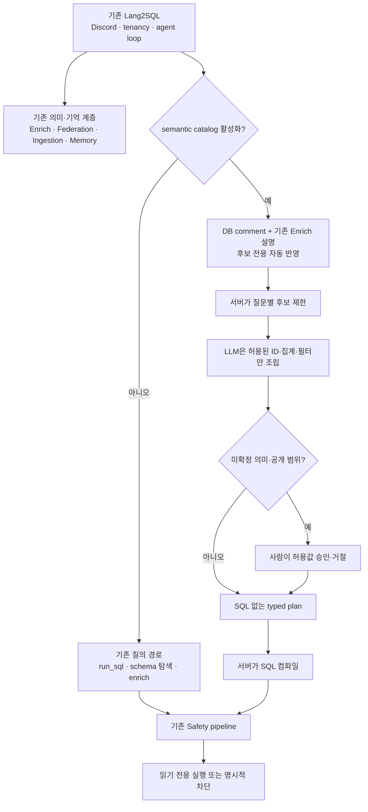

# 연결 즉시 의미 준비형 질의

이 기능은 기존 Lang2SQL의 ContextFlow를 대체하지 않는다. Enrich는 DB를 이해하기
위한 의미 가설을 만들고, Semantic federation은 팀별 정의를 축적하며, Memory와
Discord는 기존대로 동작한다. 이 PR은 그 구조 위에서 **DB 질문을 실행하는 경계**만
추가로 제한한다.

> 서버는 질문별 후보를 제한하고 모델은 그 후보를 조립한다. 실행에 필요한
> 불확실한 업무 의미는 사람이 확인하며, SQL은 서버 코드가 결정론적으로 만든다.

## 한눈에 보기



즉, **ContextFlow는 의미를 발견하고 팀별로 축적하는 구조**이고, 연결 즉시 의미 준비형
질의는 **현재 질문을 실행 가능한 typed plan으로 안전하게 바꾸는 추가 모드**다.

## 사용 흐름

1. 관리자가 Discord `/setup`으로 DB를 연결한다. credential-bearing DSN을 받는
   raw `/connect`는 Discord에 노출하지 않는다.
2. Lang2SQL이 어댑터가 제공하는 table/column 이름·타입·nullability·설명,
   PK/FK·unique constraint 같은 메타데이터를 읽는다. row 값은 샘플링하지 않고
   연결 세대와 함께 catalog를 원자적으로 활성화한다.
3. 실제 DB comment는 검색 후보로 자동 반영한다. source와 전체 물리 fingerprint가
   같은 재연결일 때만 같은 scope의 기존 `/enrich` 설명 캐시도 재사용한다. 실제
   LLM provider가 설정된 `auto` 모드에서는 raw row 없이 물리명, 타입, 이 후보만으로
   metadata-only 보강을 한 번 더 수행한다.
4. 자동 보강은 `suggested_aliases`만 추가한다. 승인 alias, 집계, join, 공개
   등급은 바꾸지 않으며 실패 상태와 사유도 연결 결과에 표시한다.
5. 선언된 FK는 child → parent 방향의 안전한 join 후보로 등록한다.
6. 개인정보·credential·서술문·식별자형 문자열 컬럼은 기본 차단한다.
7. 나머지 불확실한 문자열 차원은 값 샘플 없이 공개 검토 후보로 둔다.
8. 불투명한 분류 컬럼은 `/semantic_dimension_candidates`의 15분 mapping
   token으로 업무 분류 표현만 연결할 수 있다. 값 샘플이나 공개 승인은 없다.
9. 관리자는 `/semantic_candidates`의 15분 후보 토큰으로 `/semantic_release`를
   `confirm:false` → 동일 actor·token·tier의 `confirm:true` 두 단계 실행한다.
10. 불투명한 수치 컬럼은 `/semantic_metric_candidates`의 후보 토큰으로 업무
   표현만 같은 두 단계로 연결할 수 있다. 집계 의미는 아직 승인하지 않는다.
11. 사용자가 실제 질문을 하면 모델은 allowlisted ID, 질문 원문에 실제 존재하는
   표현, 집계, 분류, 미지원 의무를 조립한다.
12. 처음 보는 지표 집계와 분류 표현은 서로 독립된 `/semantic_review` 항목이 될 수
   있다. 한 질문에 검토가 두 번 필요할 수도 있다.
13. 같은 요청자가 같은 프로세스에서 15분 안에 검토를 마치고 DB source가
    바뀌지 않았다면 승인 당시의 immutable typed draft를 LLM 재해석 없이 재개하고
    `semantic_query`가 결정론적 SQL을 컴파일한다.
14. 컴파일 SQL은 기존 SafetyPipeline, metric contributor 보호, 차원 공개 제한을
    모두 통과한 뒤에만 실행·표시된다.

관리자가 다른 사용자의 review를 승인하거나 프로세스가 재시작된 경우에는 의미
결정만 저장된다. 관리자 채널에서 타 사용자의 DB 결과를 실행하거나 표시하지 않으며,
원 요청자가 질문을 다시 제출해야 한다.

## 기존 ContextFlow와의 관계

| 기존 구성 | 이번 PR에서의 관계 |
|---|---|
| Enrich가 값 샘플로 컬럼 의미 가설을 생성 | legacy 연결에서는 유지한다. source·물리 fingerprint가 같은 재연결이면 저장된 설명을 후보로 재사용하되 승인으로 간주하지 않는다. 새 연결 보강은 row 값을 LLM에 보내지 않는다. |
| Semantic federation이 조직·채널·사용자별 정의를 축적 | 그대로 유지한다. 팀별 용어 정의와 현재 DB 질문의 실행 승인은 서로 다른 책임이다. |
| agent loop가 `run_sql(sql=...)`을 호출 | catalog가 없는 연결에서는 유지한다. catalog가 활성화된 연결에서만 `semantic_query`로 교체한다. |
| 기존 Safety pipeline이 SQL을 검사 | 그대로 사용하고, 앞단에 candidate·typed plan 검증을, 뒷단에 결과 공개 정책과 source stamp 검사를 추가한다. |

## Discord 접근 및 검토 권한

- DB 연결과 semantic governance 명령은 guild 관리자만 실행한다.
- 자연어 DB 질의는 기본적으로 guild 관리자만 허용한다.
- 일반 구성원은 운영자가 `LANG2SQL_DISCORD_QUERY_CHANNEL_IDS`에 명시한 상위
  채널에서만 질문할 수 있다. thread는 상위 채널 정책을 따른다.
- DM은 사용자별 scope/session으로 격리해 허용한다.
- 잘못된 채널 허용 목록은 일부만 적용하지 않고 봇 시작을 실패시킨다.
- 이 allowlist와 결과 억제 규칙은 DB row/column RBAC를 대신하지 않는다.

현재 역할별 DB 정책은 범위 밖이다. 따라서 초기 실험은 read-only 전용 DB 계정,
최소 권한, 신뢰된 전용 채널을 사용해야 한다.

## 공개 라이브러리 경계

Discord가 아닌 호스트는 모델이 SQL을 작성하지 않는 `Lang2SQLRuntime`을 사용한다.
`connect → candidates → human feedback → typed plan → execute` 순서를 지키며,
호스트/모델은 SQL을 주고받지 않는다. `connect`는 메타데이터만 읽고, `candidates`는
질문에 맞춘 bounded ID와 타입만 준다. 사람이 `ReviewRequest.allowed_choices`에서
명시적으로 고른 값을 `feedback`에 제출한 뒤에만 공개 범위나 의미 검토가 바뀐다.
`execute`는 같은 사용자·대화·DB source에 묶인 일회용 `PreparedPlan`만 받는다.

typed draft의 predicate는 명시적 AND, exact `EQ` 또는 값 최대 20개의 `IN`만
허용하며 모든 값은 bound parameter가 된다. 한 질의에는 최대 8개 filter와
dimension별 1개 filter만 허용한다. predicate 실행은 source의 공개 데이터 확인과
해당 dimension의 공개 승인이 모두 필요하다. 기간은 native `DATE` 차원의 ISO date
`[start, end)` 창만 받는다. 기존 파일을 read-only로 연 SQLite와 DuckDB만 검토
기반 실행을 지원한다. 상세 DTO와 안전한 검토 루프는
[`LIBRARY_API.md`](LIBRARY_API.md)에 있다.

## 안전 경계

- semantic catalog가 하나라도 존재하면 `run_sql`은 모델 도구 목록에서 제거된다.
- catalog JSON이나 연결 binding이 손상돼도 raw SQL 경로로 되돌아가지 않는다.
- PII 의심 컬럼은 metric/dimension 후보에 포함하지 않는다.
- 문자열 차원의 관리자 공개 승인과 질문 표현 연결 승인을 분리한다.
- 공개 승인 전 후보 ID는 모델 도구 enum에도 포함하지 않는다.
- Discord stewardship의 객체 후보·행동 토큰은 15분, action, source ID, 연결 세대에
  묶인다. 객체 토큰은 관련 object state/epoch를, catalog-wide public/reset 토큰은
  전체 catalog revision을 검증한다. metric/dimension map과 dimension release는 추가로
  경고를 실행한 reviewer와 payload에 묶여 경고 없는 실행이나 payload 변경을 차단한다.
- 공개 API의 `CandidateSet.candidate_token`은 별도 15분 action capability가 아니다.
  runtime 인스턴스의 HMAC 키와 scope·actor·conversation·source·원 질문에 묶이고,
  plan 시점에 현재 catalog shortlist를 다시 검증한다. 재연결·runtime 재시작에는
  폐기되며 host도 한 질의 조립 뒤 저장하지 않고 새 `candidates`에서 다시 받는다.
- review commit, pending 삭제, receipt, audit은 하나의 SQLite transaction이다.
- pending review 전용 KV에는 질문 원문·필터 값·날짜 경계를 저장하지 않는다. 같은
  프로세스에서는 15분 메모리 payload로 정확히 재개하고, 재시작 뒤에는 결정을
  적용한 다음 원 질문 재제출을 안내한다. 다만 Discord의 일반 대화 transcript에는
  사용자가 보낸 질문이 별도 보존되므로 운영 환경은 session 보관 정책을 함께
  정해야 한다.
  같은 reviewer·ID·choice 재시도는 idempotent이고 다른 actor/choice 재사용은 차단된다.
- parent → child fan-out, 경로 없음, 동률 경로는 SQL 없이 차단한다.
- child → parent join은 nullable FK와 orphan fact를 버리지 않도록 `LEFT JOIN`한다.
- 실행 전·실행 후·audit 후 catalog stamp를 확인하고, Discord 렌더 직전에도 같은
  stamp를 재검사한다. revoke/reset/재연결이 감지되면 준비된 행을 폐기한다.
- 요청한 group-by가 빠지거나 모델이 복사한 표현이 질문에 없으면 멈춘다.
- 서버가 인식했거나 모델이 명시한 미지원 filter·기간·단위·업무 조건은 버리고
  실행하지 않는다. 모델이 자연어의 숨은 조건을 전혀 발견하지 못하는 문제는 별도
  planner 평가 대상이다.
- `ask_user`는 단독 tool call로만 허용되고, clarification을 반환하면 해당 turn을
  즉시 중단한다. Discord에는 SQL 형태를 제거한 한 번짜리 transient 상태만 저장한다.
- 기존 `/enrich`와 `/org_setup` 자체를 제거하지 않는다. 다만 검토형 연결에서는
  raw-value sample-to-LLM 경로를 도구 목록에서 비활성화한다.
- DSN·extras·catalog는 한 SQLite transaction으로 활성화한다.
- `/semantic_reset`도 15분 action token의 경고/확인 두 단계가 필요하다.

## 결과 공개 정책

두 정책은 별개다.

1. **질의 권한**: 누가 연결 DB에 질문할 수 있는가.
2. **결과 억제**: 허용된 질문의 집계나 범주를 표시해도 되는가.

비공개 기본값에서는 grouped/ungrouped 여부와 무관하게 `SUM`, `AVG`, source-row
`COUNT`의 실제 기여 행이 5개 미만이면 결과 전체를 차단한다. 빈 결과와
NULL-only metric도 차단한다. `MIN`/`MAX`는 contributor 수로 극값 노출을 숨길 수
없으므로 컴파일하지 않는다.

`controlled_grouped` 차원은 각 결과 그룹의 실제 metric contributor 최소 5를
유지한다. metadata-safe boolean처럼 자동 안전 판정된 차원은 제한된
`public_grouped`로 사용할 수 있다. 그 밖에 관리자가 승격한 `public_grouped`와
predicate 사용은 `/semantic_public_data`로 현재 연결 전체가 공개·비개인
데이터임을 확인해야 한다. 다만 최대 50범주와 표시 라벨 128자 제한은 유지한다.
공개 데이터 범위에서도 하나라도 controlled 차원이 포함되면 contributor 보호와
`MIN`/`MAX` 차단이 다시 적용된다.

최소 contributor 5는 보수적인 출력 억제 규칙이지 k-anonymity, differential
privacy, row-level security 또는 사용자 권한 보장이 아니다.

## 현재 지원 범위

지원:

- 숫자 컬럼의 표현별 `SUM`/`AVG`
- 공개 데이터 범위이며 controlled 차원이 없는 경우의 `MIN`/`MAX`
- 모든 테이블의 명시적 physical source-record `COUNT(*)` (PK 불필요)
- categorical dimension group-by
- declared FK를 따라가는 유일한 child → parent 1~N hop join
- 기존 file-backed SQLite와 DuckDB의 read-only 검토 기반 실행과 결과 비교
- metadata-only 문자열 공개 후보 및 수치 지표 후보
- 모든 비차단 dimension의 metadata-only phrase mapping과 conflict 검증
- 질문 시점의 metric/dimension review와 immutable draft 재개

의도적으로 차단 또는 clarification:

- timestamp/relative/fiscal/cohort 기간과 검토되지 않은 단위 변환
- raw SQL, row projection, OR/NOT·부분 문자열·자유 filter expression
- 자유 수식과 파생 지표 실행
- composite FK
- parent-to-child fan-out 또는 여러 최단 join path
- PII/credential/서술문/식별자형 문자열 컬럼
- 숫자형 calendar/code/identifier의 자동 역할 분류
- 역할별 row/column policy

검토형 경로가 인식한 제한은 조용히 버리지 않는다. typed blocker로 끝나며 raw
SQL 생성으로 우회하지 않는다. 현재 실제 안전 실행 증거는 existing file-backed
SQLite와 DuckDB뿐이다. 다른 DB를 연결할 수 있다는 사실과 같은 compiler·timeout·
취소 동작이 검증됐다는 주장은 구분하며, 검증되지 않은 원격 dialect 실행은
fail-closed한다.

## LLM에 남아 있는 역할

모델은 사용자 문장에서 shortlist 안의 metric/dimension 후보와 아직 표현하지
못한 의무를 구조화한다. 서버는 다음을 독립적으로 강제한다.

- ID가 질문별 bounded allowlist에 있는가
- 모델이 복사한 표현이 실제 질문에 있는가
- 표현·컬럼·집계 연결이 현재 source/revision에 대해 확인됐는가
- join이 metric grain을 늘리지 않는 유일한 child-to-parent path인가
- 기간·단위·group-by 의무가 누락되지 않았는가
- SQL과 결과가 safety/disclosure gate를 통과했는가

따라서 작은 모델이 후보를 잘못 고르면 임의 SQL 대신 검토·clarification·block으로
귀결될 가능성이 커진다. 다만 모델이 자연어의 숨은 필터를 아예 발견하지 못하는
문제까지 결정론적으로 해결했다고 주장하지 않는다. 자연어 planner 정확도는
별도 local-model 평가로 측정해야 한다.

## 검증 경계

```bash
uv sync --extra duckdb
uvx ruff check src/lang2sql tests bench/local_model_semantic_eval.py examples/semantic_runtime_quickstart.py
uv run mypy src/lang2sql examples/semantic_runtime_quickstart.py
env -u OPENAI_API_KEY -u LANG2SQL_LLM_BASE_URL \
  uv run pytest -q
```

GitHub Actions는 Python 3.10과 3.12에서 DuckDB import를 필수로 확인한 뒤 같은 lint,
type-check, 전체 테스트를 실행한다.

회귀 검증에는 테스트 중 생성하는 다중 테이블 SQLite fixture와 물류·발전·교육·
고객지원·조위 어휘 변형을 사용한다. 별도 공개 평가는 BIRD Mini-Dev와 정부·과학
CSV에서 만든 21개 SQLite DB의 28개 case(dev 11 DB, holdout 10 DB)를 사용한다.
17개는 typed-query 의도 범위이며 기대 결과는 exact result, 공개 정책 차단 또는
문서화한 coverage difference로 나뉜다. 나머지 11개는 미지원 의무를 안전하게
차단해야 하는 case다. dataset 고유 mapping과 gold SQL은 `bench/**` 밖의 제품
코드나 모델 입력으로 나가지 않는다.

oracle-plan 실행은 compiler, join, disclosure, 실제 결과 동일성을 검증한다. gold
semantic plan을 사용하므로 자연어 planner 정확도를 증명하지 않는다. nullable FK를
보존하는 production `LEFT JOIN`이 frozen oracle의 `INNER JOIN`보다 orphan fact를
하나 더 보존하는 경우도 별도 coverage-policy difference로 보고하며 gold를 제품
동작에 맞게 고치지 않는다.
